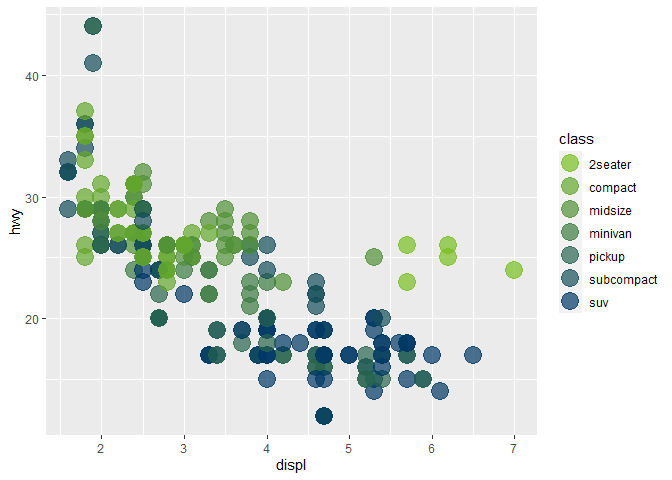
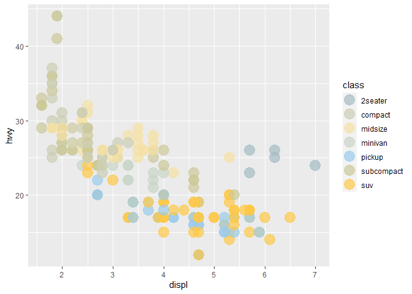
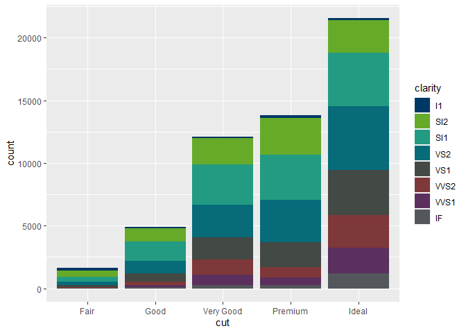
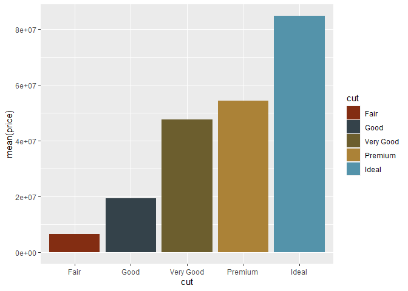
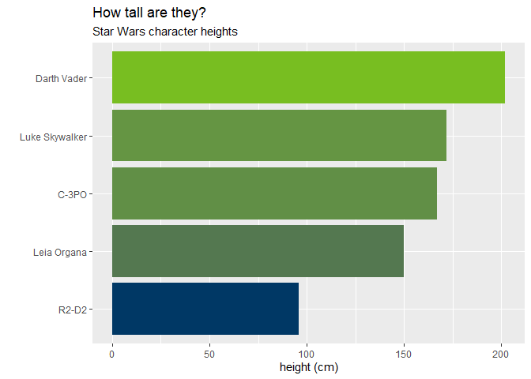
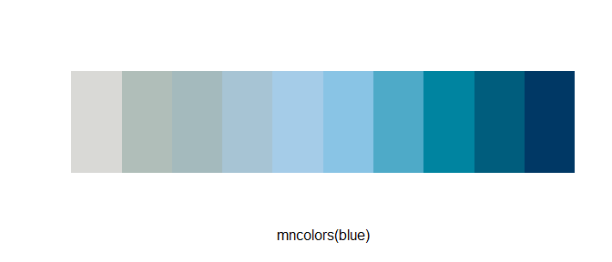
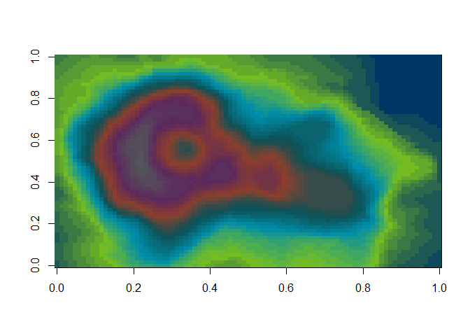

# OPM Color Palettes

*I"m working on making this package specific to OPM!*

Use the `opmcolors` package to paint your data with colors from the [OPM brand standards
guide](https://opm365.sharepoint.com/SitePages/OPM-Brand-Standards.aspx)

Use the palettes with `ggplot2` or `plot` to give your charts some OPM
style.

## Install

To install `opmcolors`:

``` r
# First install the 'remotes' package
install.packages("remotes")

# Now you can install mncolors from github
remotes::install_github("bpffjl/opmcolors")
```

## The Palettes

There are currently 13: primary, accent, extended, blue, green, gray,
safety, **primary_accent**, **primary_extended**,
**primary_accent_extended**, corn, treefrog, and caryfish.


<br>

**More specifically:**

``` r
opm_palettes
```

## $primary
## OPM Blue OPM Light Blue        OPM Red OPM Light Gray 
## "#093453"      "#009ED1"      "#D13138"      "#727477" 
## 
## $secondary
## OPM Orange        OPM Tan       OPM Gold OPM Muted Blue      OPM Green  OPM Bold Blue 
## "#D16A00"      "#C4B595"      "#E1B424"      "#527794"      "#008540"      "#005999" 
## 
## $opm_blue_3
## OPM Blue        OPM Red OPM Light Blue 
## "#093453"      "#D13138"      "#009ED1" 
## 
## $opm_blue_5
## OPM Blue       OPM Gold     OPM Orange        OPM Tan OPM Muted Blue 
## "#093453"      "#E1B424"      "#D16A00"      "#C4B595"      "#527794" 
## 
## $opm_light_blue_3
## OPM Light Blue       OPM Blue        OPM Red 
## "#009ED1"      "#093453"      "#D13138" 
## 
## $opm_light_blue_5
## OPM Light Blue       OPM Gold     OPM Orange      OPM Green  OPM Bold Blue 
## "#009ED1"      "#E1B424"      "#D16A00"      "#008540"      "#005999" 
## 
## $opm_red_3
## OPM Red       OPM Blue OPM Light Blue 
## "#D13138"      "#093453"      "#009ED1" 
## 
## $opm_red_5
## OPM Red       OPM Gold OPM Muted Blue        OPM Tan  OPM Bold Blue 
## "#D13138"      "#E1B424"      "#527794"      "#C4B595"      "#005999" 
## 
## $opm_gray_4
## OPM Light Gray       OPM Blue OPM Light Blue        OPM Red 
## "#727477"      "#093453"      "#009ED1"      "#D13138" 

## Examples

In a ggplot use the MN palettes with the `scale_fill_mn()` and
`scale_color_mn()` functions.

``` r
library(mncolors)
library(ggplot2)

# Primary
ggplot(data = mpg) +   
   geom_point(aes(x = displ, y = hwy, color = class), size = 6, alpha = 0.7) +
   scale_color_mn(palette = "primary", reverse = TRUE)
```

<!-- -->

``` r
# Extended
ggplot(data = mpg) +   
   geom_point(aes(x = displ, y = hwy, color = class), size = 6, alpha = 0.7) +
   scale_color_mn(palette = "extended")
```

<!-- -->

``` r
# Primary + Accent
ggplot(diamonds) + 
  geom_bar(aes(x = cut, fill = clarity)) +
  scale_fill_mn(palette = "primary_accent")
```

<!-- -->

``` r
# Crayfish
ggplot(diamonds) + 
  geom_col(aes(y = mean(price), x = cut, fill = cut)) +
  scale_fill_mn(palette = "crayfish")
```

<!-- -->

Alternatively, use`mncolors()` to feed a specific number of colors from
a palette to a ggplot layer.

``` r
library(ggplot2)

df <- dplyr::starwars[1:5, ]

ggplot(df, aes(x = height, y = reorder(name, height), fill = height)) +
    geom_col() + 
    scale_fill_gradientn(colors = mncolors(5, palette = "primary")) +
  theme(legend.position = "none") +
  labs(title = "How tall are they?",
       subtitle = "Star Wars character heights",
       x = "height (cm)",
       y = "")
```

<!-- -->

## Lots of colors!

Enter any number you want to `mncolors()` to return a bucket of colors.

``` r
mncolors(10, "blue")
```

    ##  [1] "#D9D9D6FF" "#B0BEB9FF" "#A4BABDFF" "#A7C4D4FF" "#A5CCE8FF" "#89C4E5FF"
    ##  [7] "#4EAAC8FF" "#0084A0FF" "#005D7DFF" "#003865FF"

<!-- -->

``` r
mncolors(100, "green")
```

<!-- -->

## Base plots

In this example we use the `primary_accent` palette directly via the
`colorRampPalette()` function.

``` r
# Volcano example

## Create palette
pal <- colorRampPalette(mn_palettes$primary_accent)

## Use 50 colors from it
image(volcano, col = pal(50))
```

<!-- -->
